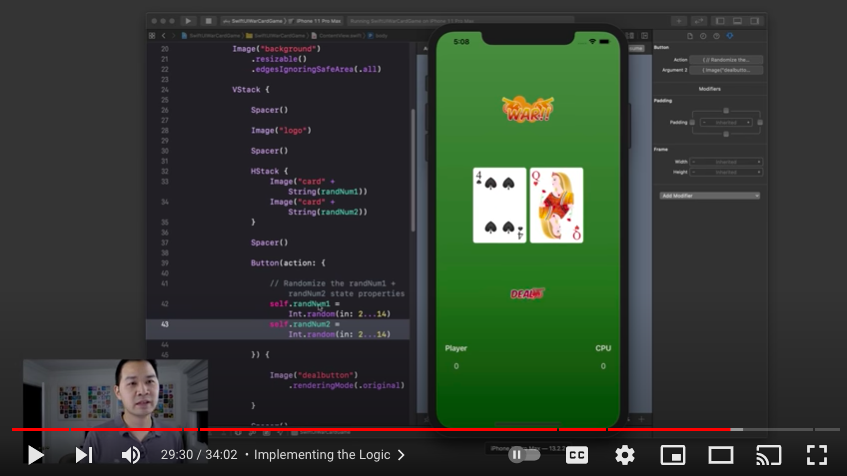
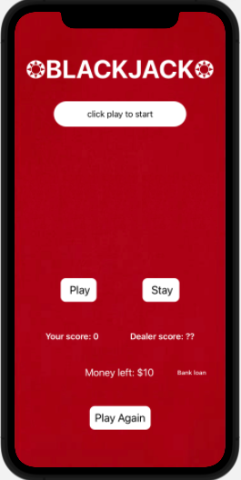
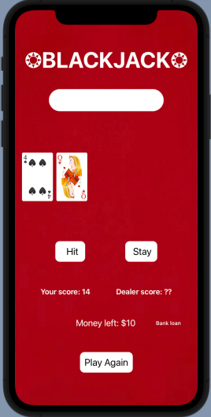
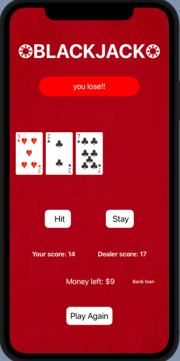
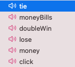

# Blackjack

Blackjack is the first iOS app I made on my own using swiftUI in xcode. Because I only had a background in java and low level python, I used multiple video tutorials and read about SwiftUI online to learn how to program in xcode. I made my first app, the card game war, by following an online tutorial by code with Chris, and used that as inspiration for my Blackjack game. Doing card game like war also allowed me to focus less on the design of the game, as I already had a baseline from the war game, and focus more on learning how to code in swift.

I started by first creating an initial user interface for the app then writing the program for it. I chose to create the user interface through code rather than by using a storyboard. When creating the UI, I had to learn how to resize images and layer items on top of eachother in order to create my desired design. I also did a lot of updates to the user interface of Blackjack later in my development process when receiving feedback from users.

I then focused on adding in the baseline functionality for a blackjack game, which was mainly composed of a hit and stay button. I spent a lot of time fixing buggy code, but did some research on implementing functions in swift in order to clean up my code and soon the game was functional. I then had to work on creating a hand for the dealer so the user would either win or lose. I did so by utilizing the random function in xcode to give the dealer random card until their hadn total was 17 or above. Once the user of the game could hit or stay and the dealer was given cards, the basic blackjack game was ready and I had to learn how to finish the game. I created a function for the game end and added a button that would reset the app so the user could play again. At this point, my Blackjack app was playable and was being tested by classmates. 

  

I continued working to improve the app, adding features such as a player money balance that increased/decreased based on their game result. I also took feedback from classmates on how to improve the interface of the app in order to make it easy to play and engaging. To increase engagement, I learned how to add sound effects to the app, which is one of my favorite feautures. If I have the chance to continue to improve the game, I'd like to add a title screen that the user is taken to before the actual game screen, and a how-to-play screen with instructions. I believe adding these screens would be easier to do using storyboards, an aspect of swift that I will be looking to become familiar with in the future. I'd also like the user to be able to see the cards in the dealer's hand so the app more closely resembles an actual blackjack game.

  
